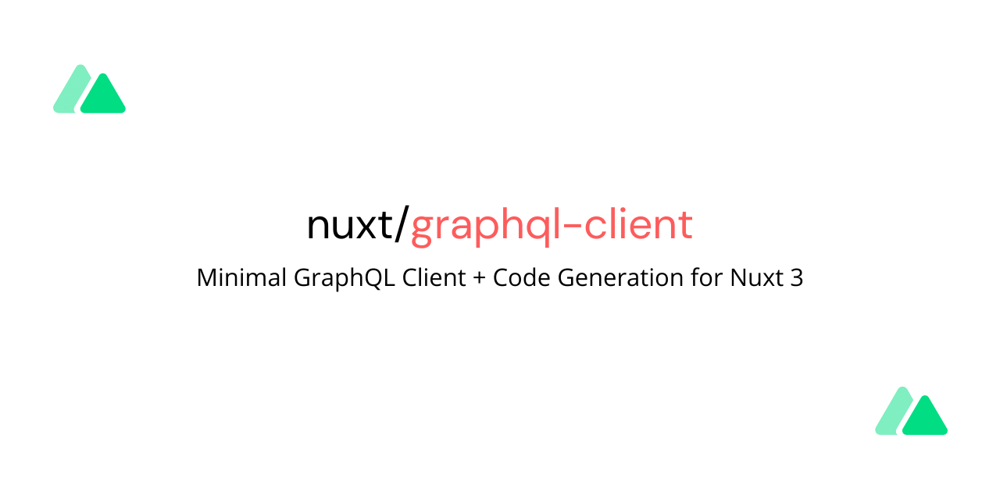

<h1 align="center">nuxt-graphql-client</h1>

⚡️ Minimal GraphQL Client + Code Generation for Nuxt

  
  
  
  
  
  
  

> ⚡️ Minimal GraphQL Client + Code Generation for Nuxt

- [Documentation](https://nuxt-graphql-client.web.app)

## Features

- Zero Configuration
- 🚀 [Nuxt 3](https://v3.nuxtjs.org) Support
- Full Typescript Support
- HMR (Hot Module Reload) for GraphQL documents
- Minimal [GraphQL Client](https://github.com/prisma-labs/graphql-request#graphql-request) + [Code Generation](https://www.graphql-code-generator.com/)

## Preview

## Credits

[`nuxt-graphql-client`](#nuxt-graphql-client) is developed by [@diizzayy](https://github.com/diizzayy).

Special thanks to [@danielroe](https://github.com/danielroe) for helping me navigate and making this possible!

## License

[MIT](./LICENSE) License © 2022 [Diizzayy](https://github.com/diizzayy)
